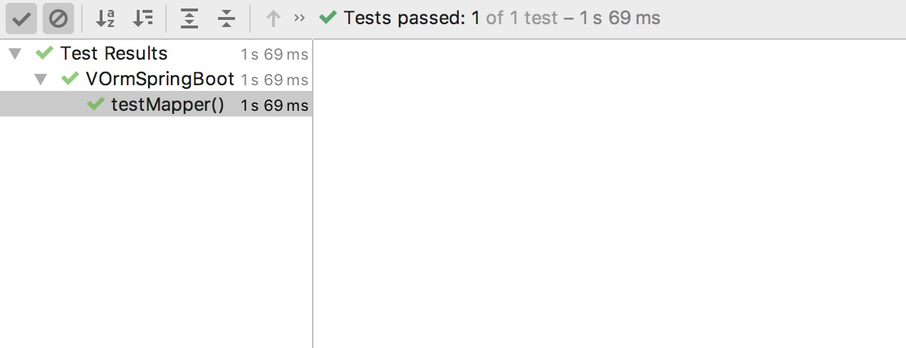

###介绍

**v-orm**框架是在mybatis之上，做了定制化封装，无需更多使用配置，遵照DDD领域驱动设计。较之于mybatis plus 更易用，更简洁，可分钟级别自动代码生成controller、service、vo、dto、entity等，以及elementui的页面，简化开发流程。学习和使用成本更低。
    核心功能：
    
        1、ORM框架：无需关注底层SQL逻辑
        2、使用简单：和mybatis使用完全一致，没有其他使用成本
        3、代码规范：统一的代码结构、接口格式、响应编码、异常信息编码，用起来更规范
        4、代码生成：可分钟级别自动代码生成controller、service、vo、dto、entity等，以及elementui的页面。
        5、功能灵活：提供基础VService可builder模式灵活查询任意数据，满足更多定制化需求
        6、支持主从切换（暂不支持分库分表）
        7、支持多数据源
        8、支持多种数据库（mysql、oracle）

上文介绍了v-orm的基础使用教程，有同学反馈如果想自定义SQL查询怎么办？
答案是使用mybatis的注解形式，进一步验证了对mybatis的0干扰。

###自定义SQL使用教程

1.  创建Mapper

```java
import io.github.itliwei.vboot.vorm.entity.TestEntity;
import org.apache.ibatis.annotations.Select;

import java.util.List;

/**
 * @author : liwei
 * @date : 2021/03/08 22:35
 * @description : mapper文件
 */
public interface TestMapper {
    @Select("select * from tmp_user")
    List<TestEntity> selectAll();
}

```
这里由于属性和字段是一一对应的，所以就不需要@Result注解了。

2.  启动类的扫描路径

```java
@SpringBootApplication(scanBasePackages = {"io.github.itliwei.vboot.vorm.orm","io.github.itliwei.vboot.vorm"})
@MapperScan("io.github.itliwei.vboot.vorm.mapper")
public class VOrmSpringBootDemoApplication {

    public static void main(String[] args) {
        SpringApplication.run(VOrmSpringBootDemoApplication.class, args);
    }

}
```
加上了@MapperScan注解，扫描到mapper文件所在的路径。

3.  测试一下

```java
@SpringBootTest
class VOrmSpringBootDemoApplicationTests {
    @Autowired
    private TestMapper testMapper;

    @Test
    void contextLoads() {
        List<TestEntity> testEntities = testMapper.selectAll();
        Assert.isTrue(!CollectionUtils.isEmpty(testEntities),"true");
    }

}
```
通过一个单元测试，注入testMapper，执行单元测试方法


4. 结果展示

 
 可见，正常执行了。
 
 ###总结
 
 由此可以基于mybatis的使用方式，自定义SQL，完成一些比较复杂的，多表操作的查询。同时由于微服务化盛行的今天，不建议业务中有大量的多表关联查询。因为会对未来的分库分表造成很大的不便。
 
 具体业务具体分析，切勿一概而论。
 
 